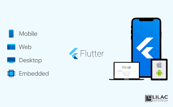

<h1 align="center">
    
</h1>

Mobile App feita em Flutter

📌 FatContainer 
------------------
O projeto foi feito com flutter e dart para practicar redimensionamento com variaveis

🔧 Tecnologias utilizadas:
------------------

- FLUTTER
- DART 

💬 Fale comigo
------------------
[*Entre em contato comigo*](https://www.linkedin.com/in/ivo-baptista-3712144/)

